# 아키텍처 흐름 다이어그램

이 문서는 `docs/agent/project-context.md`, `docs/agent/architecture.md`, `docs/agent/domain-overview.md`, `docs/agent/coding-convention-detected.md`, `docs/agent/risky-areas.md`와 실제 코드 진입점을 기준으로 작성했다. 코드로 명확하지 않은 부분은 단정하지 않는다.

## 1. Request Flow

일반 REST 요청은 `SecurityFilterChain`을 거친 뒤 Controller -> Service -> Repository 흐름으로 처리된다. WebSocket은 `/ws` endpoint와 STOMP 흐름을 따르므로 별도 섹션에서 다룬다.

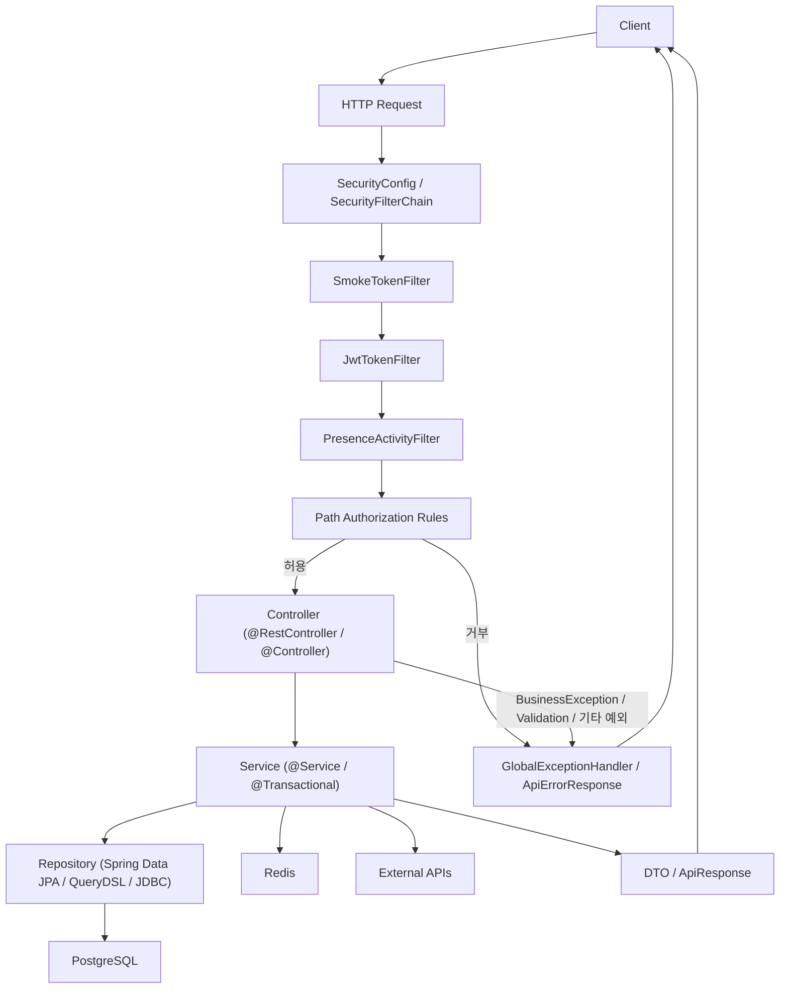

확인된 규칙:

- `core.domain.*`는 업무 도메인, `core.global.*`는 보안/설정/예외/Redis/WebSocket/이미지/메트릭/외부 연동을 맡는다.
- API 응답은 주로 `core.global.dto.ApiResponse`와 DTO를 사용하지만, 일부 Controller는 DTO를 직접 반환한다.
- `Entity`를 직접 API 응답으로 반환하지 않는 원칙이 문서화되어 있다.

## 2. Authentication Flow

인증은 로그인/회원가입 시 JWT를 발급하고, 일반 요청에서는 `JwtTokenFilter`가 header 또는 cookie의 access token을 확인해 `SecurityContext`를 구성하는 방식이다.

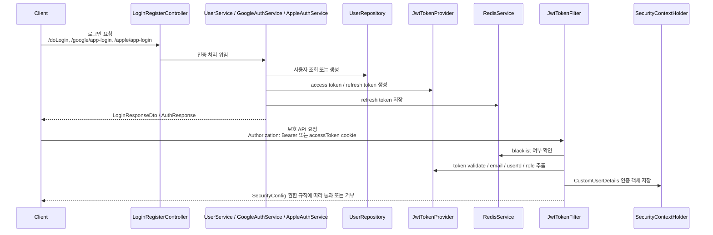

권한 판단 구조:

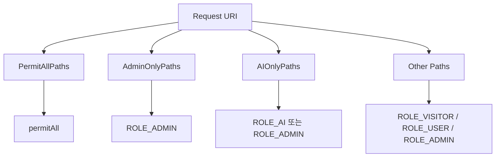

주의할 점:

- `SecurityConfig`, `JwtTokenFilter`, `JwtTokenProvider`, `PermitAllPaths`, `AdminOnlyPaths`, `AIOnlyPaths`는 고위험 영역이다.
- Refresh token은 Redis에 저장되고, logout 시 access token blacklist와 refresh token 삭제가 수행된다.
- WebSocket 보안은 HTTP Security와 별도 흐름이며 `StompChannelInterceptor`를 함께 확인해야 한다.

## 3. Chat Flow

채팅은 STOMP `/app` 메시지를 `ChatWebSocketController`가 받고, `ChatMessageService`가 DB 저장, 번역, 수신자 계산, 이벤트 발행을 처리한다. 실제 WebSocket 전송과 채팅 push 알림은 이벤트 리스너에서 이어진다.

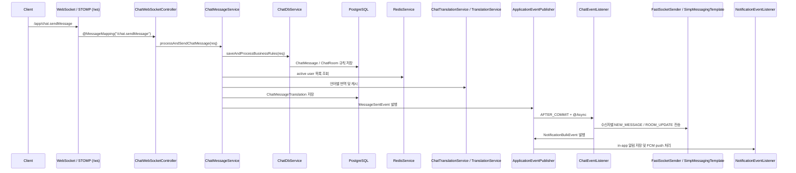

읽음/삭제/미디어 메시지:

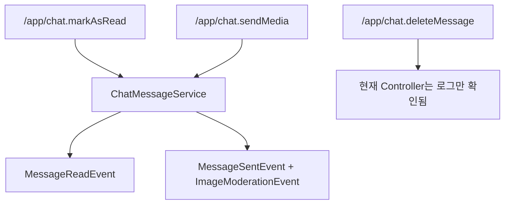

주의할 점:

- 메시지 저장, 번역, 이벤트 발행, WebSocket 전송, push 전송 순서는 임의로 바꾸면 안 된다.
- `/chat.sendMessageBad`는 레거시/성능 테스트용 경로로 남아 있다.
- `ChatWebSocketController.deleteMessage`는 코드상 로그만 남기는 것으로 확인되어 실제 삭제 구현 위치는 추가 확인이 필요하다.

## 4. Image Upload Flow

이미지 업로드는 presigned URL을 발급하고, 클라이언트가 Object Storage에 직접 업로드한 뒤, 게시글/프로필/채팅방 등 도메인 저장 시 key 또는 URL을 받아 최종 경로로 복사/저장하는 구조다.

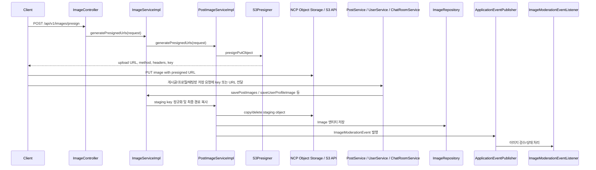

삭제와 실패 보상:

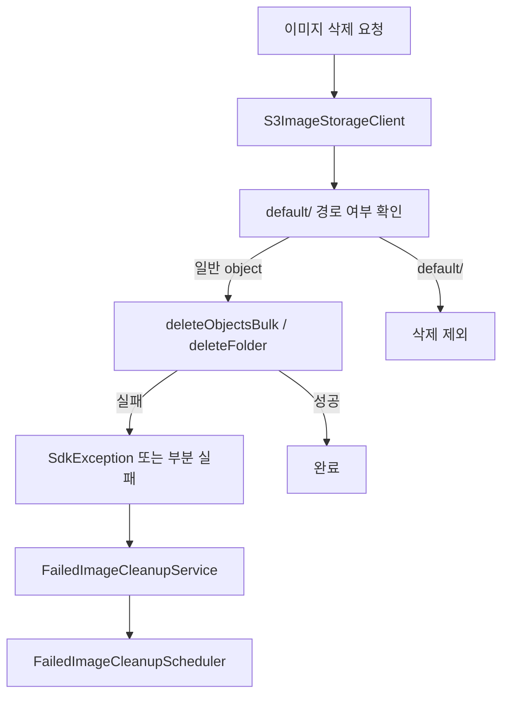

주의할 점:

- `default/` 경로 이미지는 삭제 대상에서 제외된다.
- URL과 object key 변환, CDN URL, thumbnail URL, staging key 규칙은 클라이언트 표시와 실제 삭제에 직접 영향을 준다.
- `FailedImageCleanup` 흐름은 현재 작업트리에 변경이 존재하므로 같은 파일을 다룰 때 최신 상태를 다시 확인해야 한다.

## 5. Notification Flow

알림은 도메인 이벤트를 받아 in-app `Notification`을 저장하고, 사용자 push 동의/카테고리 설정/채팅방 음소거를 확인한 뒤 Firebase FCM으로 전송한다.

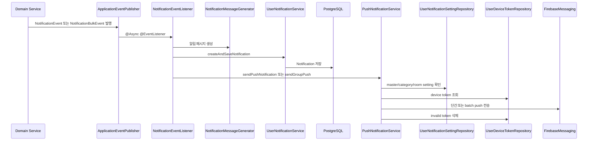

채팅 알림은 `ChatEventListener`에서 `NotificationBulkEvent`를 발행해 대량 알림 흐름으로 이어진다.

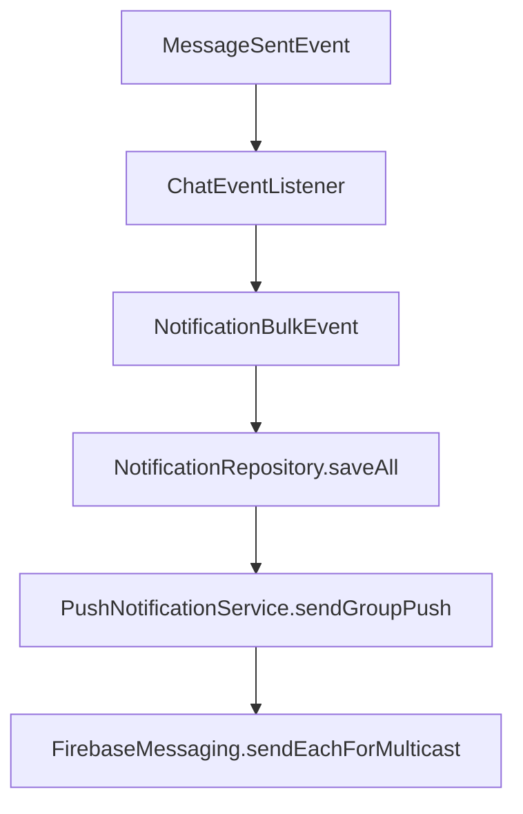

주의할 점:

- 알림 타입 enum 변경은 DB constraint, migration, 클라이언트 표시 로직과 함께 확인해야 한다.
- FCM 실패 시 `UNREGISTERED`, `INVALID_ARGUMENT`, `SENDER_ID_MISMATCH` 계열 token은 삭제된다.
- `PushNotificationService`는 `@CircuitBreaker` fallback을 사용한다.

## 6. Payment Flow

결제는 `/api/iap/verify`에서 플랫폼별 store 검증을 수행하고, purchase, entitlement, item, bonus grant를 저장한다.

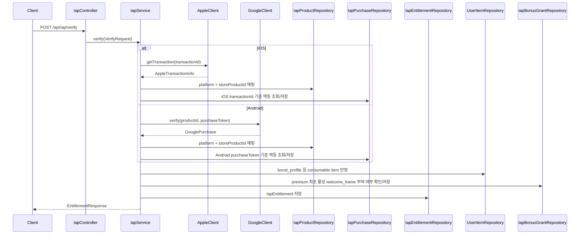

권한 조회:

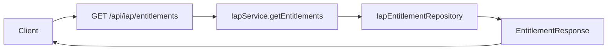

주의할 점:

- 결제 멱등성 기준은 iOS `transactionId`, Android `purchaseToken`이다.
- product catalog와 store product id 전체 목록은 코드만으로 확정하지 않는다.
- Android 상품 미매핑 시 TODO성 error code 사용이 있어 에러 정책은 불명확하다.

## 7. AI User Flow

AI 응답은 일반 채팅 메시지가 저장된 뒤 `MessageCreatedEvent`가 커밋 이후 처리되면서 시작된다. AI 메시지도 최종적으로 `ChatMessageService.processAndSendChatMessage`를 다시 호출해 일반 채팅 전송 흐름을 탄다.

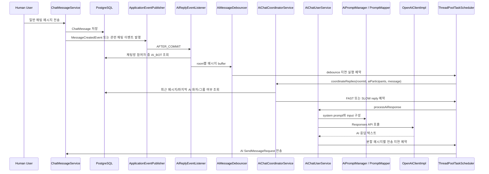

AI 응답 제어:

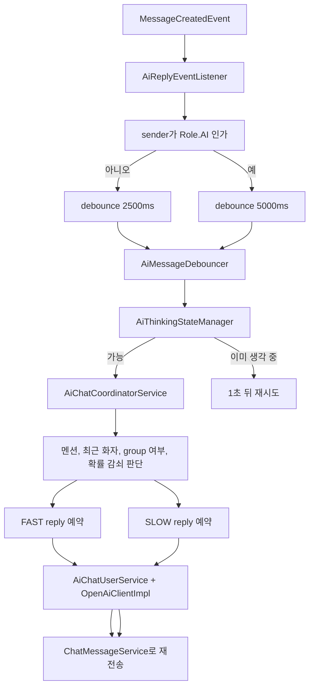

주의할 점:

- AI 응답은 `@TransactionalEventListener(phase = TransactionPhase.AFTER_COMMIT)` 이후 시작된다.
- jailbreak/AI identity 패턴 필터와 `PASS` 응답 skip 로직이 있다.
- AI 응답 정책, prompt 버전 관리, 안전 필터링 기준은 코드 외부 문서가 없어 완전히 확정할 수 없다.

## 공통으로 불명확한 부분

- 실제 운영 인프라, secret 관리 방식, Prometheus/Grafana dashboard, 배포 파이프라인 전체는 저장소만으로 확정할 수 없다.
- Elasticsearch 템플릿과 스크립트는 존재하지만 Java 코드에서 직접 사용하는 흐름은 확인되지 않았다.
- README의 `Spring Batch` 표기는 `build.gradle`에서 dependency가 확인되지 않으므로 현재 실행 흐름으로 단정하지 않는다.
