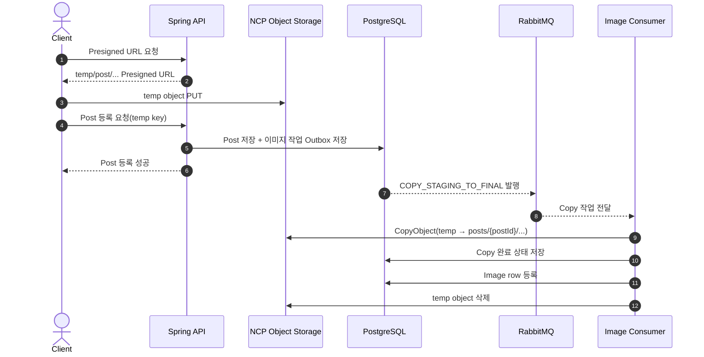
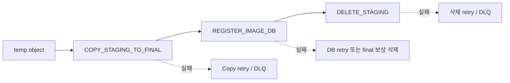
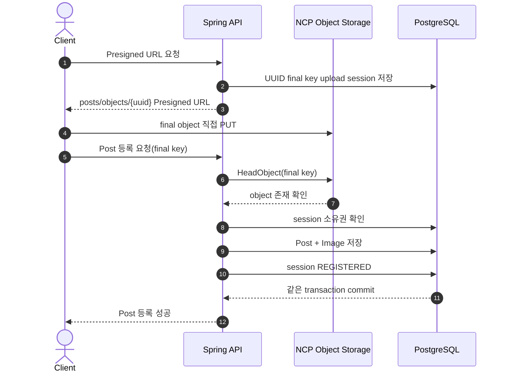
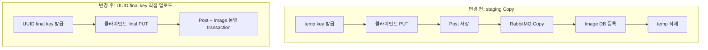

# Post 이미지 Final Key 직접 업로드 전환

## 결론

기존에는 Post ID가 생성되기 전에는 final key를 만들 수 없다고 판단하여 이미지를 `temp/`에 업로드한 뒤 서버가 final 경로로 Copy했다.

현재는 Post ID 대신 UUID로 final key를 먼저 생성한다. 클라이언트가 처음부터 final object에 업로드하고, Post와 Image DB를 같은 transaction에서 저장한다.

```text
변경 전: temp 업로드 → 서버 Copy → Image DB 등록
변경 후: UUID final key 직접 업로드 → Post와 Image DB 동시 등록
```

## 변경 전 구조



### 변경 전 필요한 복구 작업



이미지 등록 하나를 위해 Copy, DB 등록, staging 삭제의 부분 실패를 각각 추적하고 복구해야 했다.

## 변경 후 구조



정상 이미지 등록에서는 서버가 `CopyObject`, `REGISTER_IMAGE_DB` Consumer, `DELETE_STAGING`을 수행하지 않는다. Post 등록 전에 이미지마다 `HeadObject` 1회로 실제 object 존재를 확인한다.

## 핵심 구조 차이



## 실패 상황 비교

### 변경 전

```text
Post 저장 성공
→ Copy 실패
→ 이미지가 보이지 않음
→ Copy retry 필요

Copy 성공
→ Image DB 등록 실패
→ DB에 연결되지 않은 final object 발생
→ DB retry 또는 보상 삭제 필요

Image DB 등록 성공
→ staging 삭제 실패
→ temp object 잔존
→ 삭제 retry 필요
```

### 변경 후

```text
final object 업로드 성공
→ Post 등록 실패
→ final object가 미등록 상태로 남음
→ upload session 만료 정리로 삭제

Post 등록 transaction 성공
→ Post와 Image DB가 함께 저장됨

Post 등록 transaction 실패
→ Post와 Image DB가 함께 rollback됨
```

부분 실패 지점이 여러 단계에서 하나로 줄었다.

## 제거되거나 역할이 축소된 기능

| 기능 | 변경 후 역할 |
| --- | --- |
| `COPY_STAGING_TO_FINAL` | 신규 UUID final key 흐름에서는 사용하지 않음 |
| `REGISTER_IMAGE_DB` Consumer | 신규 흐름에서는 사용하지 않음 |
| `DELETE_STAGING` | 신규 흐름에서는 staging object가 없으므로 사용하지 않음 |
| Copy retry/DLQ | 기존 `temp/` 호환 흐름에서만 유지 |
| Copy 성공 후 DB 실패 보상 삭제 | 신규 흐름에서는 불필요 |

## 계속 사용하는 기능

| 기능 | 사용하는 이유 |
| --- | --- |
| `ImageOperation` / Outbox | 기존 object 삭제와 미등록 object 정리 추적 |
| RabbitMQ retry/DLQ | object 삭제 실패 복구 |
| `image_upload_session` | final object 소유권과 등록 여부 추적 |
| `DELETE_OBJECT` | Post 수정·삭제 후 기존 object 정리 |
| `FailedImageCleanup` | RabbitMQ/Outbox 장애 fallback |

## 최종 비교

| 항목 | 변경 전 | 변경 후 |
| --- | --- | --- |
| 최초 업로드 경로 | `temp/post/...` | `posts/objects/{uuid}` |
| final object 생성 | 서버가 `CopyObject` | 클라이언트가 직접 PUT |
| Post와 Image DB 저장 | 서로 다른 단계 | 같은 transaction |
| 정상 등록 RabbitMQ 의존 | 있음 | 없음 |
| 정상 등록 서버 NCP 작업 | Copy + staging 삭제 | 없음 |
| 주요 미등록 object 문제 | Copy된 final object | 직접 업로드 후 등록하지 않은 final object |
| 미등록 object 해결 | 보상 삭제 | upload session 만료 정리 |
| 구조 복잡도 | 단계별 retry와 보상 필요 | 등록 transaction과 만료 정리로 단순화 |

## 현재 호환 경로

기존 앱이나 요청이 전달하는 `temp/` key는 아직 기존 Copy 재시도 파이프라인으로 처리한다.

```text
신규 UUID final key
→ 직접 등록 구조

기존 temp key
→ 기존 Copy 재시도 구조
```

실제 환경 검증과 클라이언트 전환이 끝난 후 기존 `temp/` 호환 흐름 제거 시점을 결정해야 한다.
